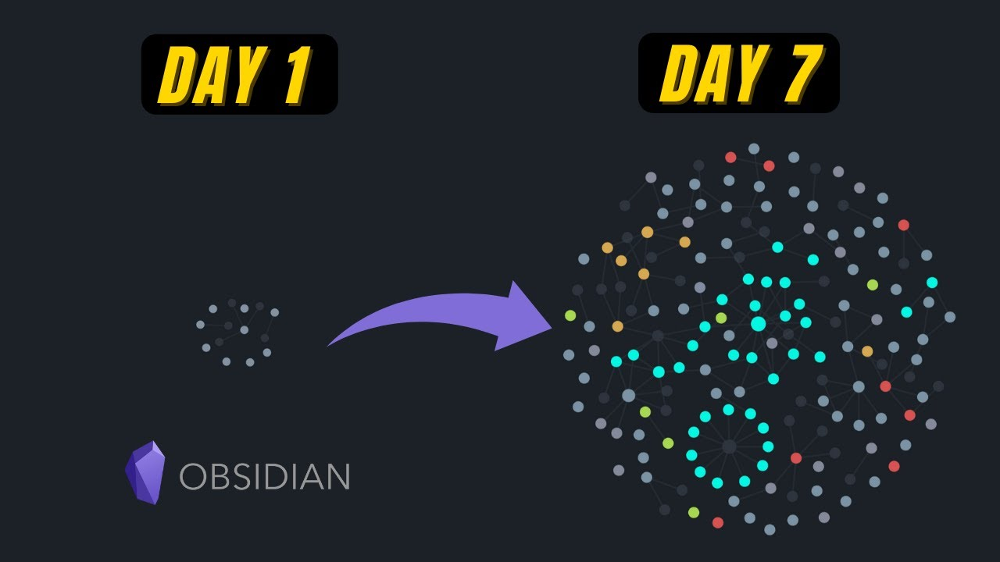

# Obsidian Brain Notes

	Image taken from [This video](https://www.google.com/url?sa=i&url=https%3A%2F%2Fwww.youtube.com%2Fwatch%3Fv%3DXxJZvfo8FOw&psig=AOvVaw0QaLoJRH6dzBBT2Yp9jRyE&ust=1693791794013000&source=images&cd=vfe&opi=89978449&ved=0CBIQjhxqFwoTCPi_sKOojYEDFQAAAAAdAAAAABAQ)

The idea of this project is to store all my notes in several topics, but mainly on this ones:
- Hacking.
- Programming.
- Artificial Intelligence.
- DevOps.
- Maths.
- Book Notes.
